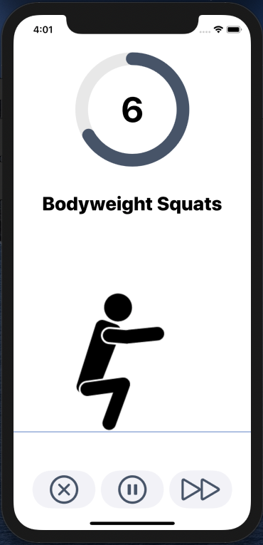

# SoFit
TINF18B5 Software Engineering Projekt

SoFit ist eine Fitness-Assistent-App für iOS und hat die drei Hauptfunktionen Zielsetzung, Training und Monitoring. 
Alle weiteren Funktionen lassen sich diesen Hauptbereichen unterordnen und sind über die drei Hauptseiten Home, Gym und Stats aufrufbar. 
Dort werden dem Anwender Informationen aufbereitet, die sich aus ausgelieferten Daten und anwender-abhängigen Daten errechnen. 
Die Berechnung der Daten ist das Alleinstellungsmerkmal der Fitness-Assistent-App.

## HomeView

Der HomeView ist die erste Seite die der User zu sehen bekommt. Deswegen soll sie einladend wirken und zum bevorstehenden Training motivieren.
Dies geschieht über einen, sich bei jedem Aufruf ändernder, Motivationssolgan. Auch bildet der HomeView die Möglichkeit alle weiteren Seiten zu erreichen.

## GymView

Auf dem GymView werden dem User fünf verschiedene Workouts vorgeschlagen. Drei Faktoren sind für die Auswahl der Workouts entscheidend:
* Die Präferenz des Users, eingestellt unter Preferences
* Die Historie: um Wiederholungen zu vermeiden, werden zuletzt verwendete Workouts mit geringerer Wahrscheinlichkeit ausgewählt
* Bei Workouts ähnlicher Präferenz und Historie entscheidet der Zufall

Die vorgeschlagenen Workouts werden in ihrer Schwierigkeit an den Fitnesslevel des Users angepasst. Der User kann aber auch selbst die vorgeschlagenen 
Wiederholungen der Übungen hoch- und runtersetzen und somit die Schwierigkeit beeinflussen. Das wirkt sich auf den Score aus, den der User nach erfolgreichem Abschließen eines Workouts gutgeschrieben bekommt.

## Das Training selbst

Im Training wird dem User eine Vorbereitungszeit von 10 Sekunden gegeben. Diese kann je nach Bedarf unter Preferences erhöht oder gesenkt werden. 
Nach Ablauf der Vorbereitungszeit beginnt das Workout. Sowohl während der Vorbereitung, als auch während des Trainings werden die Workouts über eine Animation visualisiert, 
um dem User intuitiv zu instruieren. Der User kann jederzeit  
das Training pausieren, verlassen oder die Vorbereitung auf die Übung bzw. die Übung selbst zu überspringen.

## Preferences

Preferences ermöglichen es dem User, das Training an **ihn** speziell anzupassen. Dabei kann er einstellen, wann er an sein Training erinnert werden möchte.
Dabei kann er Tag und Uhrzeit auswählen. Zusätzlich kann angegeben werden, ob die Erinnerung täglich oder wöchentlich geschickt werden soll. So kann der User mit wenigen Klicks ganze Serien erstellen. 
Auch kann der User wie Countdown der Vorbereitungszeit anpassen und die Workouts bewerten (siehe oben). Favorisierte Workouts haben eine größere Wahrscheinlichkeit für ein Traing ausgewählt zu werden.
Dagegen komme schlechter bewertete Übungen weniger häufig vor. Auch kann der User seine Daten zurücksetzen. Dabei verliert er seinen erreichten Fitness Level, 
der Countdown wird zurückgesetzt und die Bewertungen der Workouts werden gelöscht.

 

## Stats

Hier werden Statistiken zu den absolvierten Workouts in Form angezeigt. Ein Liniendiagramm zeigt die Leistungssteigerung oder den Leistungsabfall im zeitlichen 
Verlauf. 
Darunter gibt es qualitative Aussagen zu seiner Leistung. So wird der User einerseits für seine Leistungssteigerung, über den ausgewählten Zeitraum.
Alle Statistiken bzw. Aussagen können über einen Wochen-, Zwei-Wochen- oder einen Monats-Zeitraum analysiert werden.

 

## Ziele

Zusätzlich zu den Motivations-Sprüchen auf dem HomeView, soll der User mithilfe eines Fitness Levels zum Fortschritt gebracht werden. 
Bei einem Level Up während dem Training wird dieser direkt nach absolvierung des Trainings gefeiert.

